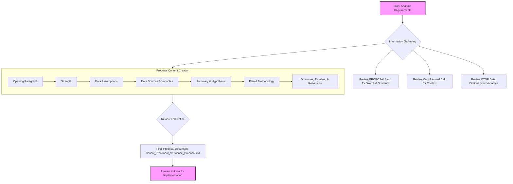

# Project Plan: Causal Treatment-Sequence Inference Proposal

This plan outlines the steps to create a comprehensive proposal document, mirroring the structure and detail of the "Multi-Modal Temporal Modeling" example in `PROPOSALS.md`.

### Detailed Steps:

1.  **Draft Opening Descriptive Paragraph:** Synthesize the project's core concept from the sketch in `PROPOSALS.md`, introducing the goal of using causal inference to move from prediction to "what-if" treatment planning.
2.  **Draft "Strength" Section:** Frame the project's strengths in alignment with the Carroll Award's goals, highlighting how the proposed methods represent a paradigmatic shift from associative models to causal, decision-support systems.
3.  **Draft "Data Assumptions" Section:** Detail the necessary data characteristics for this causal inference approach, explicitly stating the key assumptions: sequential ignorability, positivity, and correct model specification.
4.  **Draft "Data Sources" and "Variables" Sections:** Specify the "OTOP Pain Tracking Intake and Follow-Up Data" as the source and select relevant variables for treatments (e.g., `medicationreceived`, `doseamount`), outcomes (e.g., `enrollmentstatus`, `udsresults`), and confounders (e.g., `housingstatus`, `painfrequency`).
5.  **Draft "Summary" and "Hypothesis" Sections:** Write a concise summary and a clear, testable hypothesis about the causal effects of different treatment sequences.
6.  **Draft "Plan" and "Methodology Details" Sections:** Outline the project steps, from data preparation to sensitivity analysis, and elaborate on the causal estimators (IPTW, TMLE) and the role of SuperLearner.
7.  **Draft "Expected Outcomes," "Implementation Timeline," and "Resources Required" Sections:** Describe the anticipated deliverables, a realistic two-year timeline, and the necessary personnel and computational resources.
8.  **Final Review:** Read through the entire proposal to ensure coherence, detail, and strong alignment with the Carroll Award's focus on paradigmatic shifts.