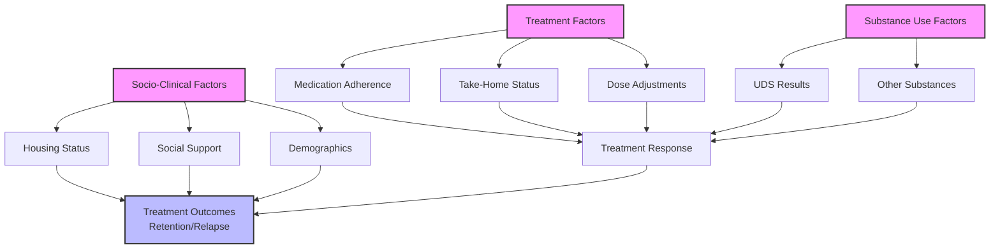

# Identifying Adolescent Risk Profiles by Clustering Adult OUD Trajectories

## Overview

This project will apply temporal multi-view clustering to a longitudinal dataset of adults with Opioid Use Disorder (OUD) to identify distinct "OUD Archetypes." By analyzing trajectories across substance use, treatment history, and socio-clinical factors, we will identify pathways that characterize established OUD. These archetypes will form the empirical basis for a future screening tool designed to identify at-risk youth. We hypothesize that these adult trajectories represent the manifestation of risk profiles that originated in adolescence, providing valuable insights for early intervention strategies.

### Hypothesis

Temporal multi-view clustering of adult OUD data will reveal 3-5 clinically distinct patient trajectory archetypes. We hypothesize that these archetypes are significantly associated with differential treatment outcomes (e.g., retention, relapse) and that their defining characteristics can be translated into a risk-factor model for predicting opioid initiation in adolescents.

### Proposal Strengths

This project aligns with the Carroll Award's focus on new paradigms by using adult OUD data to inform adolescent prevention strategies. It proposes that analyzing adult trajectories can identify risk factors relevant to youth. By using AI to discover "OUD Archetypes" from longitudinal data, this work will provide an empirical foundation for future screening tools, linking adult treatment data to adolescent public health strategy.

- **Systems-Based Approach:** Integrates substance use, treatment, and socio-clinical data as interdependent temporal streams, modeling the complex interplay of factors influencing patient outcomes. This represents a shift from treating these factors as independent variables to understanding them as parts of a dynamic system.
- **Personalized Medicine:** Enables personalized care pathways and risk stratification based on a patient's specific trajectory phenotype, moving beyond one-size-fits-all approaches.
- **Direct Alignment:** Directly aligns with the Carroll Award's focus on managing complex, interdependent systems and applying AI to drive transformative change in healthcare.

### Paradigm Shift: From Static Risk Factors to Dynamic Trajectory Modeling

Current approaches to OUD risk assessment rely on static, cross-sectional risk factors (e.g., demographics, baseline substance use). This proposal represents a fundamental shift in how we model and understand OUD by:

1. **Moving from Static to Dynamic:** Instead of treating OUD as a collection of static risk factors, we model it as a dynamic system where treatment response, substance use, and social factors interact and evolve over time.

2. **Integrating Multiple Perspectives:** Rather than analyzing treatment, substance use, and social factors in isolation, we use multi-view learning to capture how these domains influence each other. For example, how treatment adherence affects substance use patterns, which in turn impacts social stability.

3. **Discovering Natural Phenotypes:** Instead of imposing predefined categories, we let the data reveal natural groupings of patient trajectories. This allows us to identify previously unknown patterns in how OUD develops and responds to treatment.

This shift enables us to move from reactive care (responding to crises) to proactive care (anticipating and preventing negative outcomes).

## Data Requirements

### Data Sources

- OTOP Pain Tracking Intake and Follow-Up Data

### Expected Outcomes

- **Primary Outcome:** A validated set of 3-5 empirically derived "OUD Archetypes" based on temporal patterns in the adult dataset.
- **Secondary Outcomes:**
    - A comprehensive report detailing the clinical, demographic, and substance use characteristics of each archetype.
    - Prototype "risk profiles" based on these archetypes, designed to inform the development of an adolescent screening tool.
    - A foundational methodology for linking adult treatment data to adolescent prevention strategies.
    - At least two peer-reviewed publications and presentations at national conferences.

### Variables

- **Substance Use View:** `intakeuds`, `udsresults` (and their time-varying follow-up counterparts) will create a view of substance use patterns, including opioids, stimulants, and other substances.
- **Treatment Trajectory View:** `medicationreceived`, `doseamount`, `recentdose`, `takehomephase`, `mat` (and follow-up equivalents) will form a view of the treatment journey and adherence.
- **Socio-Clinical View:** `intakedate`, `dob` (to calculate age at intake), `gender`, `race`, `housingstatus`, `referral_source` will provide crucial contextual data.
- **Outcomes:** `enrollmentstatus`, `discharge_reason_1mo`, `discharge_reason_mo2`, `discharge_reason_3mo`, `discharge_reason_6mo`, `discharge_reason_12mo` will be used for archetype validation.

### Requirements

- Longitudinal intake and follow-up data for substance use, treatment, and socio-clinical variables, synchronized at common time points (e.g., intake, 1, 2, 3, 6, 12 months).
- Demographic and contextual variables for covariate adjustment and phenotype interpretation.
- A sufficient sample size (N > 200) with at least 3-4 repeated measures per patient to robustly model trajectories.

### Assumptions

- Multi-modal, longitudinal data with synchronized time points across substance use, treatment, and socio-clinical views are available.
- Sufficient within- and between-patient variability exists to support the discovery of meaningful clusters.
- Data collection protocols are consistent, and batch effects are minimal.
- Sample size requirements (TBD based on final variable selection and clustering approach) will be determined through power analysis; given the number of variables (~20) and the rule of thumb to have 10-20 subjects per covariate, a minimum sample of at least 300 subjects with complete data is recommended.
- Data completeness and dimensionality are sufficient for robust clustering and clinical interpretability.

### Conceptual Relationships of Variables

==**DRAFT** The following Mermaid diagram illustrates how different aspects of OUD treatment interact and influence each other over time:==

This diagram shows:

- Treatment factors (medication adherence, take-home status, dose adjustments) directly influence treatment response
- Substance use patterns (UDS results, other substances) both affect and are affected by treatment response
- Socio-clinical factors (housing, support, demographics) influence the entire treatment process
- All these factors together determine treatment outcomes

## Methodology

### Approach

Our approach uses advanced machine learning techniques to model the complex, interdependent nature of OUD treatment:

- **Multi-View Learning:** Traditional clustering methods analyze data from a single perspective (e.g., just treatment or just substance use). Our multi-view approach simultaneously analyzes multiple perspectives (treatment, substance use, socio-clinical) to capture how these domains influence each other.

- **Temporal Feature Engineering:** We transform raw longitudinal data into meaningful patterns that capture how patients change over time:
    - **Slope Analysis:** How quickly patients improve or decline
    - **Volatility Measures:** How stable or unstable their progress is
    - **State Transitions:** How often they move between different states (e.g., stable to unstable)
    - **Dynamic Time Warping:** How similar their overall trajectories are, even if the timing differs

- **Advanced Clustering Methods:** We use two sophisticated approaches:
  1. **Late Fusion:** First cluster each view separately, then combine the results
  2. **Joint Clustering:** Use multi-view spectral clustering to find patterns that exist across all views simultaneously

- **Validation & Interpretation:** We ensure our findings are robust and meaningful through:
    - **Internal Validation:** Using metrics like silhouette scores to ensure clusters are well-separated
    - **Stability Analysis:** Testing if clusters remain consistent across different samples
    - **Clinical Interpretation:** Working with experts to ensure findings make clinical sense
    - **Outcome Association:** Testing if different trajectory types predict different outcomes

### Implementation Plan

1. **Data Preprocessing & View Construction:** Clean and align longitudinal data streams for the substance use, treatment, and socio-clinical views at synchronized time points (intake, 1, 2, 3, 6, 12 months). Handle missing data using appropriate imputation techniques (e.g., multiple imputation).
2. **Temporal Feature Engineering:** For each view, extract and summarize temporal features that capture the dynamics of each patient's trajectory. This will include calculating slopes, volatility, time-to-change, and state transition frequencies.
3. **Multi-View Clustering:** Apply and compare late fusion (e.g., consensus clustering on single-view results) and joint multi-view clustering algorithms (e.g., multi-view spectral clustering, co-regularized k-means, or tensor factorization) to identify patient trajectory phenotypes.
4. **Phenotype Validation & Interpretation:** Assess cluster stability using resampling methods. Evaluate clinical interpretability by examining the defining characteristics of each cluster. Statistically test the association of phenotypes with key outcomes (e.g., treatment retention via survival analysis, relapse rates).
5. **Clinical Translation & Dissemination:** Develop phenotype-based risk profiles and create visualizations to communicate findings. Explore the development of a prototype dashboard for integration into clinical decision support workflows.

### Timeline

- **Phase 1 (Months 1–4):** Data acquisition, preparation, cleaning, and alignment. IRB protocol finalization.
- **Phase 2 (Months 5–10):** Temporal feature engineering and exploratory single-view clustering analysis.
- **Phase 3 (Months 11–16):** Application and evaluation of advanced multi-view clustering algorithms. Cluster validation and outcome association analysis.
- **Phase 4 (Months 17–20):** In-depth clinical interpretation of phenotypes with clinical expert panel. Development of risk profiles.
- **Phase 5 (Months 21–24):** Manuscript preparation, dissemination of findings, and development of a prototype dashboard for clinical translation.

## Risk Identification and Mitigation

### 1. Data Quality and Completeness

**Risk:** Longitudinal clinical data often has missing values and irregular follow-up intervals.
**Mitigation:**

- Use multiple imputation techniques specifically designed for longitudinal data
- Implement sensitivity analyses to assess the impact of missing data
- Leverage the temporal nature of our models to handle irregular follow-up intervals

### 2. Model Validation and Interpretation

**Risk:** Complex clustering results may be difficult to validate and interpret clinically.
**Mitigation:**

- Implement multiple validation approaches (internal, external, clinical)
- Use established metrics (silhouette scores, stability indices)
- Engage clinical experts throughout the interpretation process
- Develop clear visualization tools for communicating results

### 3. Clinical Translation

**Risk:** Technical findings may not translate into actionable clinical insights.
**Mitigation:**

- Involve clinical experts in phenotype interpretation
- Develop clear, actionable risk profiles
- Create a prototype dashboard for clinical use
- Pilot the tool with a small group of clinicians

### 4. Sample Size Considerations

**Risk:** Insufficient sample size for robust clustering.
**Mitigation:**

- Conduct power analyses to determine minimum sample size based on final variable selection and clustering approach
- Use resampling techniques to assess stability
- Implement sensitivity analyses for different sample sizes
- Consider alternative clustering approaches if sample size is limited
- Target a minimum of 300 subjects with complete data, based on the number of variables (~20) and the rule of thumb of 10-20 subjects per covariate

### 5. Technical Implementation

**Risk:** Computational challenges with complex clustering algorithms.
**Mitigation:**

- Start with simpler models and incrementally increase complexity
- Use established software packages with proven reliability
- Implement parallel processing for computationally intensive tasks
- Maintain version control and documentation of all analyses

## Resources Required

- **Personnel:** Principal Investigator (0.5 FTE), Data Scientist/Statistician (1.0 FTE), Clinical Expert Panel (consultant basis), Project Coordinator (0.25 FTE).
- **Computational Resources:** Access to a secure, high-performance computing environment with sufficient memory (>64GB RAM) and processing power for iterative clustering and validation on longitudinal data.
- **Ethics & Governance:** IRB approval for secondary data analysis. Adherence to all data governance and privacy protocols established by the institution.
- **Clinical Engagement:** Dedicated time from clinicians with expertise in addiction medicine to participate in phenotype interpretation, validation, and translation workshops.
